  
  
  
  

  
  
  
  

 

## About Me

I'm a Senior AI Engineering student at **Galala University** who builds end-to-end AI systems, from peer-reviewed research to production deployments. Two IEEE papers on explainable deep learning, ML pipelines serving real users, MLOps infrastructure that keeps them running, and mobile apps on top of all of it.

I care about systems that are **interpretable**, not just accurate. Every model I've shipped has had a Grad-CAM, SHAP, or LLM-justification layer explaining *why*, not just *what*.

**Right now:**
- 🔭 Building **Clarivera**, an AI-native study hub with RAG-based tutoring
- 🧪 Researching multi-task learning + LLM-based explanation generation
- 📱 Expanding into native Android (Kotlin) and Flutter
- 🤝 Open to AI research collaborations and MLOps/ML engineering roles

 

## Technical Skills

<table>
<tr><td valign="top" width="50%">

**Languages**
 

**ML / Deep Learning**
 

**NLP / LLMs**
 

</td><td valign="top" width="50%">

**Mobile Development**
 

**MLOps / Infra**
 

**Cloud & Databases**
 

**Explainability & Optimization**
 

**Tools**
 

</td></tr>
</table>

 

## Research & Publications

<b>Explainable Acne Severity Assessment via Ensemble Multi-Task Deep Learning and LLM Justification</b> (IEEE IMCOM 2026)

 

`DOI: 10.1109/IMCOM69009.2026.11360942` · Funded by NRF & Ministry of Science and ICT, Korea

Multi-task CNN with Grad-CAM and ROI analysis, paired with an LLM-generated natural-language justification layer for interpretable severity classification and lesion-count prediction on clinical datasets.

<b>End-to-End Optimized Ensemble Model for Alzheimer's Disease Detection</b> (IEEE IMCOM 2025)

 

`DOI: 10.1109/IMCOM64595.2025.10857489` · Funded by NRF & Ministry of Science and ICT, Korea

Gradient Boosting ensemble with automated hyperparameter search on multimodal data, reaching **95.85% accuracy**. SHAP and LIME applied for clinical interpretability.

 

## Featured Projects

<b>🎓 Clarivera, AI-Powered Study Hub</b> &nbsp; <code>React</code> <code>TypeScript</code> <code>Docker</code> <code>PostgreSQL</code> <code>GCP/Azure</code> <code>LLMs</code>

 

- Engineered an intelligent LMS aggregator with OAuth SSO (Google & Microsoft) that securely syncs live Canvas API data into a centralized, highly-available PostgreSQL backend.
- Deployed an AI chatbot leveraging RAG with context batching, gradient accumulation, and CUDA/cuDNN-accelerated inference for personalized, context-aware study insights.
- Architected a scalable MLOps pipeline using **pgvector** for automated semantic embeddings and training parallelism, deployed on Vercel via GitHub Actions CI/CD.

<b>🏥 Clinexa, AI-Powered Clinical Diagnosis Platform</b> &nbsp; <code>Python</code> <code>XGBoost</code> <code>ResNet50</code> <code>SWIN</code> <code>AWS</code> <code>Docker</code>

 

- Comprehensive, end-to-end platform for Alzheimer's diagnosis and patient management: medical professionals analyze MRI scans via custom AI models, review clinical indicators, and receive AI-generated consultation support.
- Delivered **94% clinical accuracy** for 1,000+ medical professionals via a pipeline combining XGBoost for structured clinical data with ResNet50 and SWIN Transformer for MRI analysis.
- Full-stack patient portal (results tracking, visit scheduling) plus an admin dashboard for system monitoring, scaled to HIPAA-compliant production on AWS with MySQL and CI/CD.

<b>🧬 SERA AI, Privacy-First Genetics Analysis</b> &nbsp; <code>TypeScript</code> <code>Gemini AI API</code> <code>Browser-native Processing</code>

 

- Runs entirely in-browser, genetic data never leaves the user's device.
- Delivers personalized drug recommendations and lifestyle insights, integrating Gemini-powered models to turn raw genetic data into readable, advanced interpretations.

<b>🧠 Brain Tumor Multi-Classification System</b> &nbsp; <code>Python</code> <code>CNNs</code> <code>Image Processing</code>

 

- Deep learning solution classifying brain tumors from MRI scans into glioma, meningioma, and pituitary tumor categories using CNNs and advanced image-processing methods.

<b>🔬 InceptionV3 Brain Tumor Detection</b> &nbsp; <code>Python</code> <code>TensorFlow</code> <code>Keras</code> <code>Jupyter</code>

 

- Binary classification pipeline (tumor / no tumor) built on the InceptionV3 architecture, with a complete train/test/evaluate workflow for high diagnostic accuracy.

<b>☁️ Amazon SageMaker MLOps Implementations</b> &nbsp; <code>AWS SageMaker</code> <code>Python</code> <code>MLOps</code>

 

- Collection of practical, cloud-native MLOps implementations: end-to-end pipelines for building, training, and deploying scalable ML models on Amazon SageMaker infrastructure.

<b>🔎 SageAI, Medical RAG Chatbot</b> &nbsp; <code>Python</code> <code>FAISS</code> <code>HuggingFace</code> <code>LangChain</code> <code>CUDA</code>

 

- Conversational AI that lets users chat directly with medical books and references, reaching **95% query relevance** over a 637-page corpus via a FAISS vector search pipeline with dense NLU embeddings and CUDA-accelerated inference.

<b>📡 Real-Time Edge AI Object Detection</b> &nbsp; <code>FOMO</code> <code>TensorFlow</code> <code>Quantization</code> <code>ESP32-CAM</code>

 

- Reached **94.4% accuracy** and **90.9% F1-score** on constrained hardware by applying FOMO deep learning and reducing model size by 45% via quantization, deployed directly on ESP32-CAM.

<b>🛒 Intelligent Product Recommendation System</b> &nbsp; <code>Python</code> <code>Machine Learning</code> <code>Data Analytics</code>

 

- Recommendation engine dynamically suggesting products by analyzing user behavior patterns, historical data, and clustering algorithms to maximize engagement.

<b>📚 AI Book Recommender</b> &nbsp; <code>Python</code> <code>Machine Learning</code> <code>Data Processing</code>

 

- Personalized book recommendations combining collaborative filtering and content-based techniques over user preference and literary datasets.

 

## Professional Experience

| Organization | Role | Period | Highlights |
|:---|:---|:---|:---|
| **Outlier AI** | AI Engineer & LLM Evaluation Specialist | 2024 to Present | Promoted from Attempter to Reviewer · RLHF & prompt engineering across 5+ AI projects |
| **Freelance** | AI Developer & Automation Engineer | 2024 | 60% processing-time reduction · 500+ users served via Microsoft Power Platform |
| **IEEE Galala** | AI & ML Instructor | 2023 to Present | 50+ students trained · 90% completion rate · 20+ mentored projects |
| **ICPC Galala** | Programming Instructor | 2023 to Present | 40% ranking improvement through advanced algorithmic & competitive-programming training |

 

## Recent Activity

<!--START_SECTION:activity-->
<!-- This section fills in automatically once the activity.yml workflow runs, see SETUP.md -->
<!--END_SECTION:activity-->

 

## Live Dashboard

<picture>
  <source media="(prefers-color-scheme: dark)" srcset="https://raw.githubusercontent.com/AbdelrahmanHassan111/AbdelrahmanHassan111/output/github-contribution-grid-snake-dark.svg">
  <source media="(prefers-color-scheme: light)" srcset="https://raw.githubusercontent.com/AbdelrahmanHassan111/AbdelrahmanHassan111/output/github-contribution-grid-snake.svg">
  
</picture>

 

## For Fun 😄

- ☕ Fuel: coffee and green tea, in roughly equal parts of desperation and habit
- 🐛 Favorite personality trait: turning "it works on my machine" into an actual CI/CD pipeline so it works everywhere
- 🧠 Currently trying to explain to my ML models why *they* need to be more explainable than I am
- 🏆 Personal record: debugging a Grad-CAM heatmap for 3 hours to discover the image was just rotated 90°
- 🎯 Life motto: `if not explainable: raise TrustIssues`

 

## Education

**Galala University**, B.S. in Artificial Intelligence Engineering `10/2022 to 06/2027`
Coursework: Advanced Machine Learning · Deep Learning · NLP · Computer Vision · Big Data Analytics

 

## Let's Work Together

I'm always interested in **AI research collaborations**, **MLOps/production ML roles**, and **cross-platform app builds**.

  

